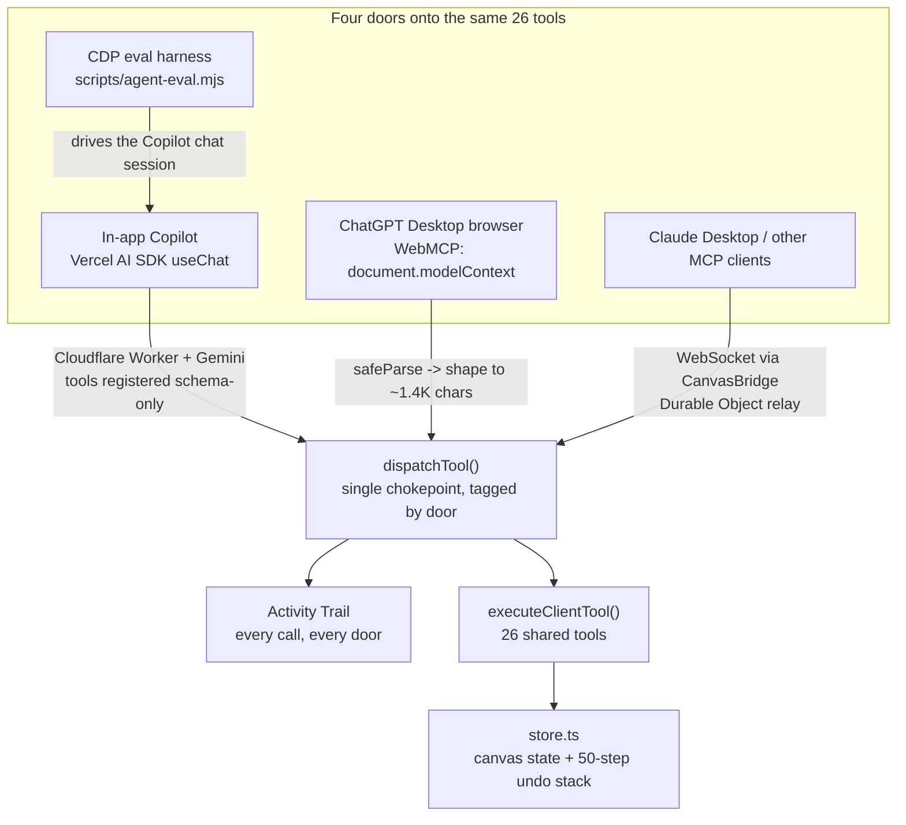

# SheetCanvas

SheetCanvas is a canvas-based spreadsheet — sheets, charts, pivots, sparklines, and live report notes on an infinite canvas — that an AI agent can operate directly, through any of **four doors** onto the same 26-tool catalog. This submission adds the fourth: **WebMCP** (`document.modelContext`), so a browser-native agent (e.g. ChatGPT's in-browser tools) can drive the canvas with no server relay in the middle.

> **Judges:** per the rules, you may grade from this document alone. Everything under [What was built for this challenge](#what-was-built-for-this-challenge) is new; everything else pre-dates the Submission Period and earns no credit. `git log pre-webmcp-baseline..HEAD` isolates the former (see that section for the exact commands and caveats).

---

## Try the WebMCP door in 60 seconds

**Option A — real ChatGPT Desktop.** Open `https://sheetcanvas.com` in ChatGPT Desktop's built-in browser (model **GPT-5.6 Sol or Terra** — Luna has WebMCP disabled), then **Settings → Browser → Permissions → "Enable site tools"**. Create a sheet with some data, then ask the agent to chart it.

**Option B — verify it locally, no ChatGPT needed.** `document.modelContext` is a Chrome origin trial (M149–156, ends 2026-11-17) not yet on stable by default — but it *is* reachable on stable Chrome behind a flag. We verified this directly:

```bash
npm run dev -- --host 127.0.0.1 --port 5173 --strictPort   # start the frontend

"/Applications/Google Chrome.app/Contents/MacOS/Google Chrome" \
  --user-data-dir="$(mktemp -d)" \
  --enable-features=WebMCPTesting \
  http://127.0.0.1:5173/
```

Open DevTools on that window and run:

```js
await document.modelContext.getTools()   // → live tool list, grows as you add data
```

**What to watch for either way:**
- The tool list is **not static** — create a sheet and `describeSheet`/`applyFormat`/`createChart` appear; create a note and `readNote`/`updateNote`/`deleteNote` appear. This is state-aware registration (see [Known limits](#known-limits) for why it isn't conversation-aware).
- The **bottom-left Activity Trail panel** logs every call from every door with a colored badge (Copilot / ChatGPT / MCP), and offers **"Undo back to here."**
- Ask for something that needs a large sheet or a wide connector catalog — the response stays small. That's WebMCP output shaping working under OpenAI's ~1.5K-character tool-result cap.

---

## What was built for this challenge

The 26-tool catalog (`agent/tools.ts`) and three of the four doors — in-app Copilot, the remote MCP server, and the CDP eval harness — pre-date the Submission Period. **New for WebMCP:**

| | |
|---|---|
| **New directory** | `src/agent/webmcp/` — 10 files, ~1,950 lines: registration state machine, result shaping, tool gating, short copy + annotations, dispatch chokepoint |
| **New files** | `src/agent/activityTrail.ts`, `src/agent/trailSummaries.ts`, `src/components/AgentActivityPanel.tsx` (cross-door activity log + "Undo back to here") |
| **New verification harness** | `scripts/webmcp-smoke.mjs` (~1,000 lines) — CDP-driven, tries real `document.modelContext` first, falls back to a spec-faithful shim |
| **New tests** | `src/agent/__tests__/{activityTrail,toolResultShaping,webmcpDescriptors,webmcpToolGating}.test.ts` |
| **Minimal call-site changes** | `useAgentSession.ts` and `useMcpBridge.ts` now call the new `dispatchTool()` instead of `executeClientTool()` directly (5–6 line diffs each, tagging each door); `App.tsx` mounts the WebMCP bridge + activity panel; `store.ts` gained one `historyBase` field the trail reads |

Also new: `src/components/WebMcpStatusIndicator.tsx` — live registered-tool count, honest `unsupported`/`blocked`/`off`/`active` states, and a kill switch.

**Boundary command** — everything after the tag is challenge work:

```bash
git log --oneline pre-webmcp-baseline..HEAD
```

> **On the boundary, stated plainly.** This repository predates the challenge by about nine months. When the challenge work began, the working tree also held an unrelated in-progress feature (cascading refresh propagation and shared canvas layout). Rather than commit both together and let it read as challenge work, that feature was separated hunk-by-hunk and committed on its own, back-dated to its real authorship date of 2026-07-21, *below* the `pre-webmcp-baseline` tag. Three files — `store.ts`, `App.tsx`, and `src/agent/clientToolExecutor.ts` — genuinely contained both efforts interleaved and were split at hunk level. The July commit was checked out in isolation and verified to typecheck and pass its tests on its own, so the tag marks a working tree rather than a broken one. Nothing above the tag is anything but WebMCP work.

---

## The `registerTool` call

From `src/agent/webmcp/webmcpRegistry.ts` (`registerOne`) — this is the real call, not a simplified example:

```ts
const controller = new AbortController();
const descriptor: WebMcpToolDescriptor = {
  name: meta.name,
  title: meta.title,
  description: meta.description,
  inputSchema: meta.inputSchema,
  annotations: meta.annotations,
  execute: (input) => executeWrapped(name, input),
};

await modelContext.registerTool(descriptor, { signal: controller.signal });
```

`meta` comes from `buildDescriptorMeta()` (`webmcpDescriptors.ts`), which converts the same zod schema the other three doors use into JSON Schema, applies WebMCP-specific short copy, and truncates anything still over budget. `executeWrapped` is the validate → dispatch → shape pipeline described in [docs/webmcp-implementation.md](docs/webmcp-implementation.md).

---

## Architecture: one dispatcher, four doors



**Why a chokepoint matters:** before this challenge, each door called `executeClientTool` directly. Now all four route through `dispatchTool` (`src/agent/webmcp/toolDispatch.ts`), tagged `'copilot' | 'chatgpt' | 'remote-mcp' | 'eval'`. One consequence: the Activity Trail observes every action regardless of which client caused it, with no per-door wiring. (In practice, the eval harness drives the same in-app Copilot chat rather than calling `dispatchTool` itself, so its calls currently surface tagged `'copilot'`; `'eval'` is a real type-level door — exercised in tests and ready in the UI badge — with no live call site yet.)

**The four doors:**

| Door | Transport | Key/secret location | Tool visibility |
|---|---|---|---|
| In-app Copilot | Vercel AI SDK `useChat` → Cloudflare Worker → Gemini (`gemini-2.5-flash`) | `GOOGLE_GENERATIVE_AI_API_KEY`, server-side only | Conversation-shaped (`selectToolNames` in `backend/src/agent/route.ts`) |
| Remote MCP | JSON-RPC 2.0 (2025-06-18) over HTTP; browser tab relays via a WebSocket → `CanvasBridge` Durable Object | Bearer token minted into D1 (`backend/src/mcp/route.ts`) | All 26, always |
| WebMCP | `document.modelContext.registerTool` in the browser tab itself — no server hop for tool execution | None — same-origin browser API | State-aware, gated on canvas facts (see below) |
| CDP eval harness | Drives the Copilot chat headlessly (`scripts/agent-eval.mjs` + `AgentEvalBridge.tsx`) | Same as Copilot | Same as Copilot |

---

## Engineering highlights (see [docs/webmcp-implementation.md](docs/webmcp-implementation.md) for the full account)

- **Result shaping** — OpenAI truncates tool results at ~1.5K characters mid-JSON. 14 shaper functions cover 17 tools (`SHAPERS` in `shapingShapers.ts`); a generic 3-step backstop (drop bulk fields → clip long strings → collapse to identity fields) guarantees every result fits, even for the 9 unshaped tools. Measured example: a synthetic 500-row × 50-col `getRange` response shrinks from 970,865 to 1,219 characters. Shaping lives **only** in the WebMCP wrapper — the remote MCP door keeps full, unshaped results.
- **Description overrides, not edits** — OpenAI caps tool descriptions at 500 characters; 13 of the 26 in `agent/tools.ts` are over (worst: `createChart` at 1,594). A second copy (`shortToolCopy.ts`) overrides them for WebMCP only, because `agent/tools.ts` has three other consumers that need the verbose, Gemini-tuned originals.
- **State-aware re-registration** — the tool set grows/shrinks with canvas state (has a sheet? a note? a schema token?), not with conversation turns, because WebMCP has no turn boundary and a tool that disappears between `getTools()` and `executeTool()` is unrecoverable for the agent.
- **No confirmation dialogs, by design** — WebMCP's `requestUserInteraction()` was removed from the spec in June 2026 and never shipped. Instead: correct `readOnlyHint`/`untrustedContentHint` annotations, every mutation undoable, and a visible Activity Trail with "Undo back to here."
- **Undo, stated honestly** — the canvas undo stack is a linear list of 50 whole-canvas snapshots with no per-step IDs. "Undo just step 3 of 5" isn't representable, so the control is "Undo back to here," and it warns before also discarding a human's interleaved edits.

---

## Setup & run

```bash
npm install                # or: npm ci (verified clean — see note below)
```

**Frontend only** (no agent tools need the backend to render the canvas):

```bash
npm run dev -- --host 127.0.0.1 --port 5173 --strictPort
```

**Frontend + backend together** (needed for the in-app Copilot and both MCP doors):

```bash
npm run dev:local
```

or the deterministic, tmux-based variant:

```bash
npm run start:app            # add -- --status / --stop / --keep-existing as needed
```

**Backend only**, if you want to run it by hand (see `backend/README.md` for full detail):

```bash
cd backend
npm install
wrangler d1 execute DB --local --file ./schema.sql
wrangler dev src/index.ts --config wrangler.toml --local --port 8787
```

The WebMCP demo itself needs **no backend and no API keys** — just a sheet with some data (paste a CSV or type into cells) and a WebMCP-capable browser (see [Try it](#try-the-webmcp-door-in-60-seconds)). The in-app Copilot needs `GOOGLE_GENERATIVE_AI_API_KEY` set for the backend (Wrangler secret or `backend/.dev.vars`); Google Analytics / Google Sheets connectors additionally need OAuth client setup — both are optional for judging the WebMCP work.

> `npm ci` note: `@tanstack/react-virtual` is pinned at `3.14.10` in both `package.json` and `package-lock.json` (a prior peer-dependency mismatch at `3.5.0` was the known failure mode; both files agree now).

## Testing / verification

```bash
npx vitest --run                 # 479 tests / 27 files passing at time of writing
npm run build                    # production build — verified clean
npm run webmcp:smoke             # WebMCP-specific CDP harness (see below)
npm run agent:eval               # browser-driven agent behavior evals
npm run seo:audit                # pre-deploy SEO/build gate
```

`npm run webmcp:smoke` (`scripts/webmcp-smoke.mjs`) validates descriptor shape/budgets, `additionalProperties` correctness, shaped-result budgets, reject-on-error, and the registration state machine — against a **real** `document.modelContext` when it can launch one (see [Try it, Option B](#try-the-webmcp-door-in-60-seconds)), or a spec-faithful CDP-injected shim otherwise (`--require-native` makes shim mode a hard failure). We ran it against a live local dev server for this submission: it correctly reached native `document.modelContext` on stable Chrome via `--enable-features=WebMCPTesting`, then hit a page-readiness timeout from concurrent hot-reloads in this shared dev environment — rerun it against a quiet dev server for a clean pass.

## Known limits

- `document.modelContext` is per-`Document` with no arbitration between tabs — one tab at a time.
- `describeConnection` under the 1.5K-char cap drops the connector payload schema (keeps `requiredFields` + one worked example instead), which costs some payload accuracy on the most complex connector (Google Analytics).
- A note larger than ~1.2K characters can't round-trip through `readNote` → `updateNote` under the cap, because `updateNote` is full-replace, not a patch.
- `createGaTrendBySource` is in no backend Copilot tool group, so the in-app Copilot can't call it even though WebMCP and the remote MCP door can — a real asymmetry, not an oversight.
- WebMCP is a W3C draft, not a finished standard; the Chrome origin trial runs M149–156 and ends 2026-11-17.
- `readOnlyHint` is deliberately withheld from `describeConnection` and `queryConnection` — both mutate store caches (`schemaToken`/GA metadata; private query results) that the next tool call in the flow depends on, so a client that treats them as read-only and dedupes/replays them would silently break the connector workflow.

## License

MIT — see [LICENSE](LICENSE).

---

## Everything else (pre-existing)

<details>
<summary>ClickHouse connected sheets, Google OAuth connectors (GA4 + Google Sheets), remote MCP bridge setup — click to expand</summary>

### Connect external agents (Remote MCP Bridge)

Exposes all 26 canvas tools to Claude Code or any MCP-compatible agent while the frontend stays a static site. Tools still execute in your browser tab; the Cloudflare Worker backend relays MCP calls over WebSocket.

1. Start the backend (see `backend/README.md`) on port 8787.
2. Open the app at `http://localhost:5173`.
3. Open the Copilot panel → click the **plug icon** in the panel header.
4. Click **"Generate MCP server URL"** — mints a bearer token and starts the relay.
5. Copy the `claude mcp add` command shown in the dialog and run it:

```bash
claude mcp add sheetcanvas --transport http http://localhost:8787/mcp/<your-token>
```

6. In Claude Code, ask it to work with your canvas:

```
> list the sheets in my canvas
> set cell A1 to "Revenue" and B1 to 42
> run SELECT * FROM Sheet1 WHERE B > 10
```

**Key constraints:** the tab must stay open while agents are working; one tab per token (opening the same token in a second tab takes over the relay); the MCP URL is a bearer capability — treat it like a password; for production, run `npx wrangler deploy` from `backend/` to ship the Durable Object migration before first use.

### ClickHouse connected sheets (backend proxy)

The ClickHouse connector uses the Cloudflare Worker backend so the browser never connects to ClickHouse directly and never stores passwords. More detail: `docs/clickhouse-connector.md`.

1. Start the backend on `http://localhost:8787` (see `backend/README.md`).
2. Optionally override the frontend's backend URL with `VITE_BACKEND_URL` (and `VITE_API_BEARER_TOKEN` if backend auth is enabled).
3. In the app: **Connect Data → ClickHouse** → create/test/save a connector → enter SQL → "Run & Create Sheet". Use the sheet header buttons to refresh or edit the SQL.

### Google OAuth connectors (GA4 + Google Sheets)

The GA4 and Google Sheets connectors use the backend to exchange OAuth codes and store refresh tokens encrypted in D1; the browser never sees the client secret.

**`Error 403: access_denied`** during local dev usually means the OAuth consent screen is in **Testing** and your account isn't allowlisted: Google Cloud Console → **APIs & Services → OAuth consent screen** → **Test users** → add your account. For personal Gmail accounts, the app must be **External** (Testing is fine for local dev); **Internal** requires a Google Workspace account in that org.

Before running locally, configure the OAuth client:
- Authorized JavaScript origins: `http://localhost:3000` (or your dev port); Authorized redirect URIs: matching, trailing slash.
- Enable: Google Analytics Data API, Google Analytics Admin API, Google Sheets API.
- Set `VITE_GOOGLE_CLIENT_ID` in `.env.local` (frontend) and `GOOGLE_CLIENT_ID` / `GOOGLE_CLIENT_SECRET` / `ENCRYPTION_KEY_B64` in `backend/.dev.vars` (local) or Wrangler secrets (prod).
- After changing OAuth config, retry in a fresh tab (or clear site data) to avoid stale OAuth state.

In the app: **Connect Data → Google Analytics** (or **Google Sheets**) → **Connect Google** → authorize → select a connector + property/range.

</details>
